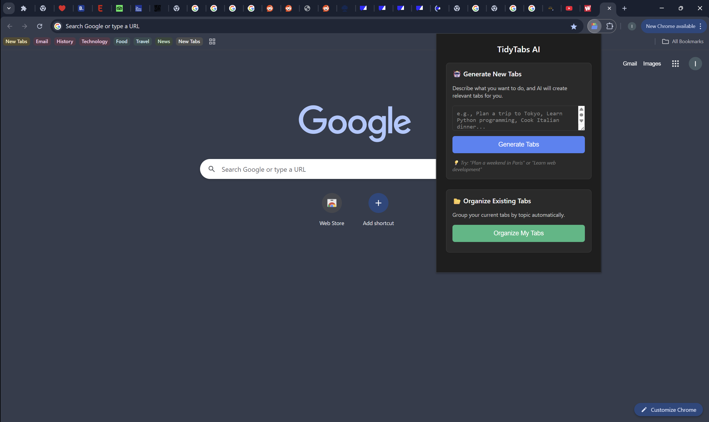
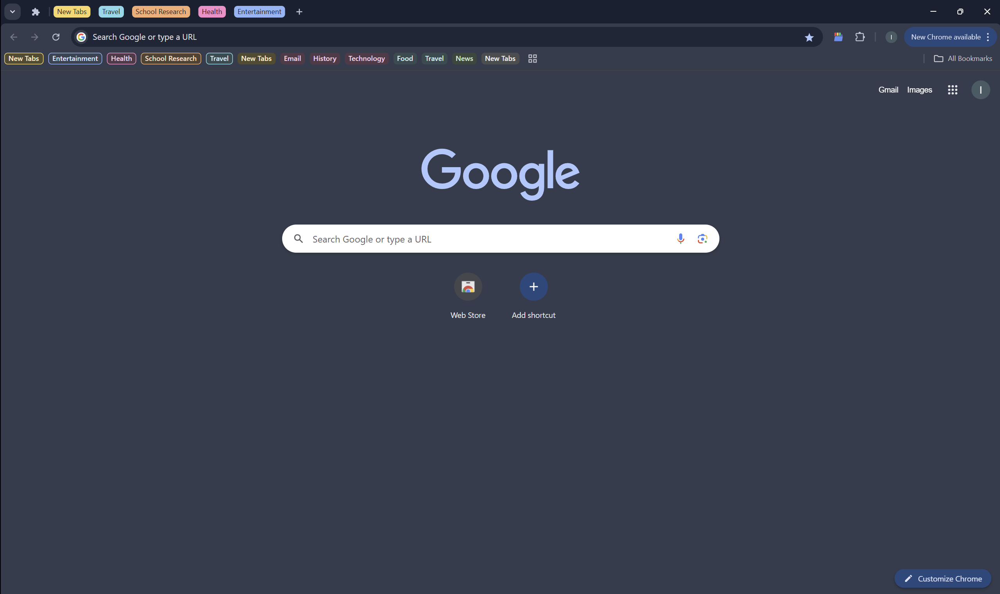
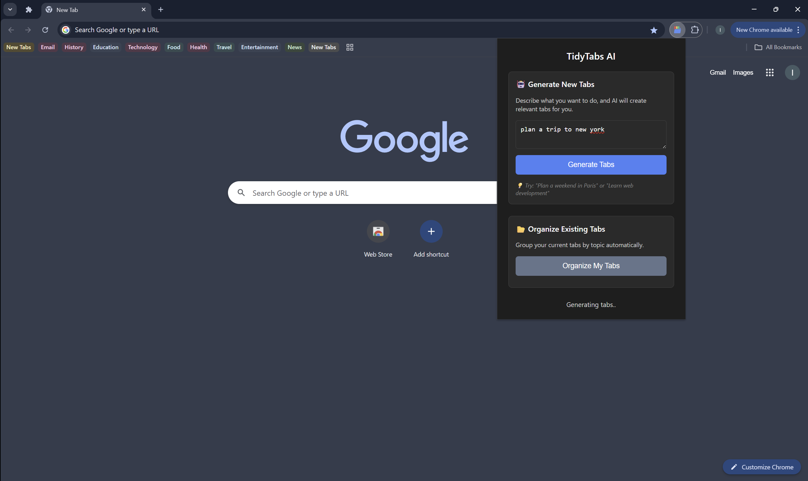
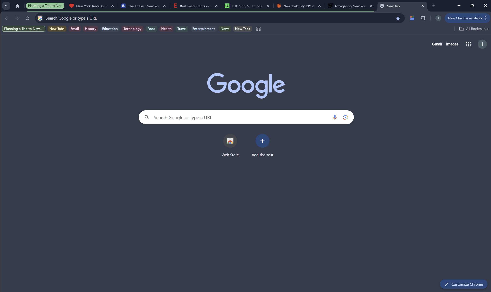

<p align="center">
  
</p>

<h1 align="center">🧠 TidyTabs — Smart Tab Organizer for Chrome</h1>

<p align="center">
  
  
  
  
  
  
</p>

- [Download Chrome Extension Here!](https://chromewebstore.google.com/detail/tidytabs/inmcfgkemanhdkhcfefdhokeogfcllap?authuser=0&hl=en)

- [Live Status Report](https://stats.uptimerobot.com/jDrCkNv4GI)

---

## 🧠 What is TidyTabs?

Ever have 27 tabs open and no idea why?

You're not alone. Between research, YouTube, emails, and five versions of “how to focus better,” it’s easy for your browser to become a digital jungle.

**TidyTabs** is a Chrome extension powered by GPT-4 that declutters your browser in one click.  
It understands what each tab is about and intelligently groups them by topic — like **Work**, **Entertainment**, or **Travel Plans** — right inside Chrome.

No more tab overload. No more chaos. Just clean, color-coded clarity.

<p align="center">
  
  
</p>

---

## ✨ Generate Tabs from a Prompt

TidyTabs can now **create useful browser tabs for you** — based on a natural language prompt like:

- “Plan a trip to New York”
- “Research budget microphones for YouTube”
- “Set up a productivity system using Notion and Google Calendar”

It will generate relevant tabs using sources like:

- Google Maps
- YouTube
- TripAdvisor
- Booking.com
- Stack Overflow
- News

<p align="center">
  
  
</p>

---

## ⚙️ How It Works

TidyTabs has two powerful AI features:

---

### 🗂️ Organize Existing Tabs

1. ✅ **Understands your tabs with context**  
   GPT-4 doesn’t just scan for keywords — it infers the *actual purpose* of each tab.

2. ✅ **Categorizes them like a pro**  
   Tabs are grouped into smart categories like **Productivity**, **Entertainment**, and **Research** — no setup needed.

3. ✅ **Applies color-coded tab groups**  
   Chrome tab groups are created and color-coded for visual clarity and faster navigation.

4. ✅ **Done in seconds**  
   All tabs are neatly grouped — instantly. You stay focused without lifting a finger.

---

### 🌐 Generate Tabs from a Prompt

1. 🧠 **Understands your intent**  
   Enter a natural prompt like “Plan a trip to New York” or “Learn Python fast” — no special syntax required.

2. 🌍 **Searches the web in real time**  
   Uses SerpAPI to pull relevant, trusted links across subtopics (e.g., maps, guides, videos, tools).

3. 🤖 **Uses GPT-4 to organize and explain**  
   GPT-4 selects the best links and gives each one a helpful title and description.

4. 🧩 **Opens a new tab group for you**  
   Tabs are automatically opened and grouped in Chrome — like building a focused browser workspace instantly.

---

## 🧭 How to Use

### 🌍 For Regular Users

1. **Install the extension** from the [Chrome Web Store](https://chromewebstore.google.com/detail/tidytabs/inmcfgkemanhdkhcfefdhokeogfcllap?authuser=0&hl=en) 

2. Click the **TidyTabs** icon in your Chrome toolbar.

3. In the popup, click **“Organize My Tabs.”**

4. The extension will:
   - Read your open tab titles
   - Use GPT to interpret and group them
   - Automatically apply Chrome tab groups by category (like **Productivity**, **News**, **Entertainment**, etc.)
   - 🔁 Tip: To regroup after opening new tabs, just click the button again!

---

### 🛠️ For Developers

#### 1. Clone the Repository

```bash
git clone https://github.com/IbrahimBilal2005/TidyTabs.git
cd TidyTabs
```

---

#### 2. Create and Activate a Virtual Environment

- **Windows:**

```bash
python -m venv venv
venv\Scripts\activate
```

- **macOS/Linux:**

```bash
python3 -m venv venv
source venv/bin/activate
```

---

#### 3. Install Required Packages

```bash
pip install -r requirements.txt
```


#### 4. Deploy the Backend to Render

- Go to [https://render.com](https://render.com)
- Click **"New Web Service"** and connect your GitHub repo
- Set the following build and deploy settings:
   - **Environment:** `Python 3`
   - **Build Command:** `pip install -r requirements.txt`
   - **Start Command:** `uvicorn main:app --host 0.0.0.0 --port 10000`
- Under **Environment Variables**, add:

   ```
   OPENAI_API_KEY=your-openai-key-here
   ```

- Deploy the service — Render will give you a public URL like `https://tidytabs-ai.onrender.com`

---

#### 5. Configure the Extension

In the root folder of this repo, create a file called `config.js`:

```js
// config.js
export const BACKEND_URL = "https://your-render-url.onrender.com";
```

> ⚠️ This file is ignored in `.gitignore` to keep your setup private. You must create it manually.

#### 6. Load the Extension in Chrome

- Go to `chrome://extensions/`
- Enable **Developer Mode** (top right)
- Click **Load unpacked**
- Select the extension folder (where `manifest.json` is located)

✅ That’s it! Your extension will now communicate with your Render-hosted FastAPI backend, which securely talks to OpenAI

---

## 🔐 Privacy First

- ✅ Only accesses **tab titles** — never full page content  
- ✅ Your **OpenAI API key stays local** in your browser  
- ✅ No user data is stored, shared, or sent anywhere other than the GPT API request

---

## 📎 Coming Soon

- Support for tab group naming themes  
- Custom categories and ignore lists  
- Persistent group state tracking
