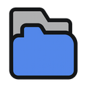
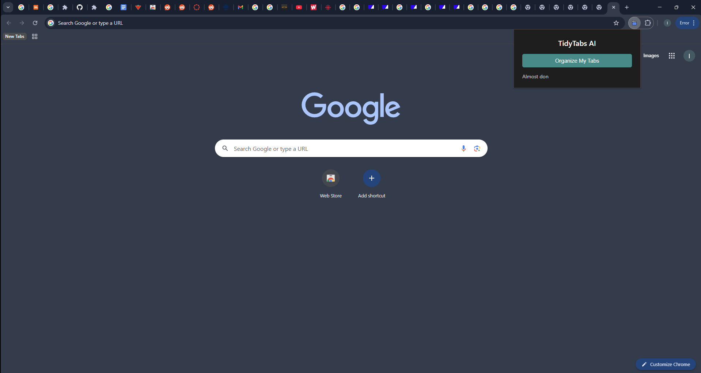
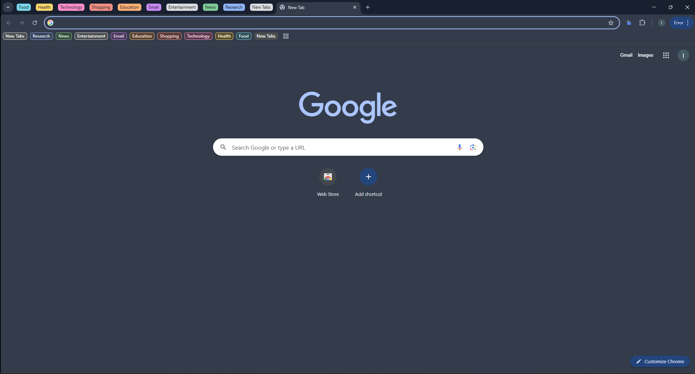

<p align="center">
  
</p>

<h1 align="center">🧠 TidyTabs — Smart Tab Organizer for Chrome</h1>

<p align="center">
  
  
  
  
  
  
</p>
<br/>


### Ever have 27 tabs open and no idea why?

You're not alone. Between research, YouTube, email, and five versions of “how to focus better,” it’s easy for your browser to become a digital jungle.

**TidyTabs** is a Chrome extension powered by GPT-4 that declutters your browser in one click.  
It scans your open tabs, understands what each one is about, and intelligently groups them by topic — like **Work**, **Entertainment**, **Travel Plans**, and more — right inside Chrome.

No more tab overload. No more chaos. Just clean, color-coded clarity.

     
---

## ⚙️ How It Works

1. ✅ **Understands your tabs with context**  
   GPT-4 doesn’t just scan for keywords — it infers the *actual purpose* of each tab.

2. ✅ **Categorizes them like a pro**  
   Tabs are grouped into smart categories like **Productivity**, **Entertainment**, and **Research** — no setup needed.

3. ✅ **Applies color-coded tab groups**  
   Chrome tab groups are created and color-coded for visual clarity and faster navigation.

4. ✅ **Done in seconds**  
   All tabs are neatly grouped — instantly. You stay focused without lifting a finger.

---

## 🧭 How to Use


### 🌍 For Regular Users

1. **Install the extension** from the [Chrome Web Store](https://chrome.google.com/webstore)  (official extension link coming soon!)

2. Click the **TidyTabs** icon in your Chrome toolbar.

3. In the popup, click **“Organize My Tabs.”**

4. The extension will:
   - Read your open tab titles
   - Use GPT to interpret and group them
   - Automatically apply Chrome tab groups by category (like **Productivity**, **News**, **Entertainment**, etc.)

### 🔁 Tip  
To regroup after opening new tabs, just click the button again!

---

### 🛠️ For Developers

If you're building, modifying, or testing the extension locally:

1. Clone or download the repo.

2. No API key setup is required — the extension communicates securely with a backend API (hosted via FastAPI on Render) which handles interactions with OpenAI.

3. Start using or editing the extension code directly. You can load it into Chrome using **Load Unpacked**:

   - Go to `chrome://extensions/`
   - Enable **Developer Mode**
   - Click **Load unpacked**
   - Select your local extension folder

4. If you need to change the backend URL (e.g., if you're self-hosting), update the API base URL in `config.js`:
   ```js
   // config.js
   export const API_BASE_URL = "https://your-fastapi-endpoint.com"; // Change this if self-hosting
---

## 🔐 Privacy First

- ✅ Only accesses **tab titles** — never full page content  
- ✅ Your **OpenAI API key stays local** in your browser  
- ✅ No user data is stored, shared, or sent anywhere other than the GPT API request

---

## 📎 Coming Soon

- Support for tab group naming themes  
- Custom categories and ignore lists  
- Persistent group state tracking
